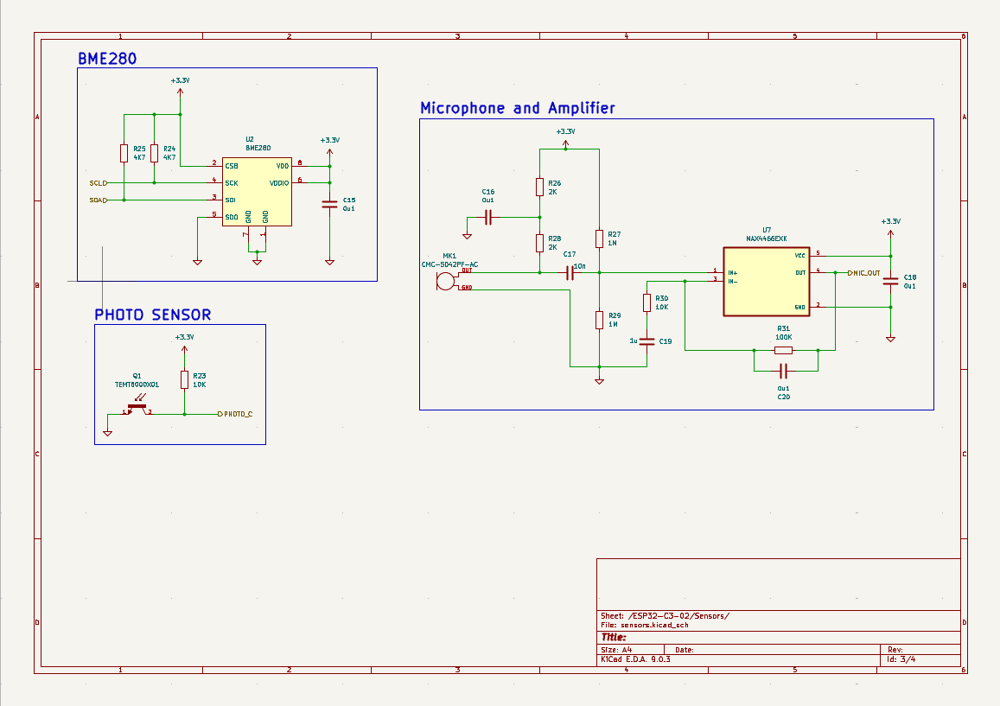
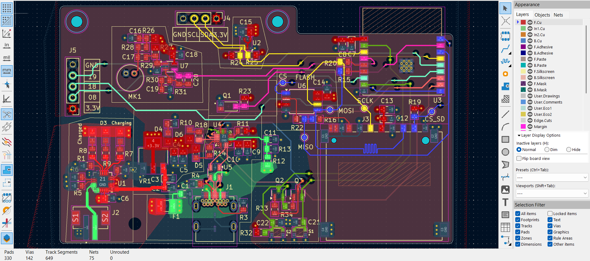

# ESP32-C3 Multi-Sensor PCB — 4-Layer Board
 
My most complex PCB design to date — an ESP32-C3 based multi-sensor IoT board featuring three sensors across a hierarchical, multi-sheet schematic. Designed over multiple days following the **Tech Explorations** tutorial series. This was my first experience with both 4-layer PCB stackup design and microphone amplifier circuit design.
 
---
 
## Preview
 
### Schematic — Root Page

 
### Schematic — Sensors Sheet

 
### Schematic — Page 2

 
### Schematic — User Interface Sheet

 
### PCB Layout

 
### 3D View

 
---
 
## Project overview
 
| Property | Details |
|---|---|
| **MCU** | ESP32-C3 |
| **Board layers** | 4-layer stackup |
| **Schematic structure** | Hierarchical — 3 separate sheets |
| **Sensors** | BME280, Electret Microphone + MAX4466EXK |
| **EDA Tool** | KiCad 9.0 |
| **Design reference** | Tech Explorations tutorial series |
| **Status** | Design complete |
 
---
 
## Board stackup
 
| Layer | Function |
|---|---|
| Layer 1 (Top) | Signal + components |
| Layer 2 | Ground plane (GND) |
| Layer 3 | Power plane (VCC) |
| Layer 4 (Bottom) | Signal |
 
A dedicated ground plane on Layer 2 ensures low-impedance returns for all sensors and clean power distribution — critical for analog microphone signal integrity.
 
---
 
## Sensors & key components
 
| Component | Part | Function | Interface |
|---|---|---|---|
| Environmental Sensor | BME280 (Bosch) | Temperature, humidity & pressure — 3-in-1 | I²C / SPI |
| Microphone | CMC-5042PF-AC (Same Sky) | 6mm omnidirectional electret condenser mic | Analog |
| Mic Amplifier | MAX4466EXK (Analog Devices) | Low-noise microphone amplifier, SC-70 package | Analog |
| MCU | ESP32-C3-02 | Wi-Fi + Bluetooth 5.0 LE microcontroller | — |
 
---
 
## Schematic structure
 
This design uses a **hierarchical multi-sheet schematic** — a professional approach for managing complex designs:
 
| Sheet | Contents |
|---|---|
| `Root page 1` | Top-level hierarchy, power distribution, ESP32-C3 core |
| `sensors.kicad_sch` | BME280 environmental sensor + microphone + MAX4466 amplifier circuit |
| `user_interface.kicad_sch` | User-facing connections, GPIO breakouts, connectors |
 
---
 
## Files included
 
### KiCad project files
| File | Description |
|---|---|
| `1st_ESP32_Demo_project.kicad_pro` | KiCad project file |
| `1st_ESP32_Demo_project.kicad_sch` | Root schematic |
| `ESP32-C3-02.kicad_sch` | ESP32-C3 sub-schematic sheet |
| `sensors.kicad_sch` | Sensors sub-schematic sheet |
| `user_interface.kicad_sch` | User interface sub-schematic sheet |
| `1st_ESP32_Demo_project.kicad_pcb` | PCB layout |
| `Footprints/` | Custom footprint library |
 
---
 
## What I learned
 
- 4-layer PCB stackup design with dedicated ground and power planes
- Hierarchical multi-sheet schematic design in KiCad 9.0
- BME280 I²C sensor integration with proper decoupling
- Electret condenser microphone biasing and signal conditioning
- MAX4466EXK low-noise amplifier circuit design
- Analog signal routing considerations on a mixed-signal PCB
- ESP32-C3 peripheral assignment and RF antenna clearance
---
 
## Tools used
 

 
---
 
## Reference
 
This design follows the **Tech Explorations ESP32 PCB Design tutorial series**.
 
> Tech Explorations: [https://www.youtube.com/@TechExplorations](https://www.youtube.com/@TechExplorations)
 
---
 
*Mymensingh Engineering College — EEE Department*
